<div align="center">

# 🎮 THE FINAL EXPEDITION

**A cinematic third-person adventure in the browser. Follow a dead woman's letter into a hidden cloud-forest gorge, and find out why the 1958 expedition never came home.**

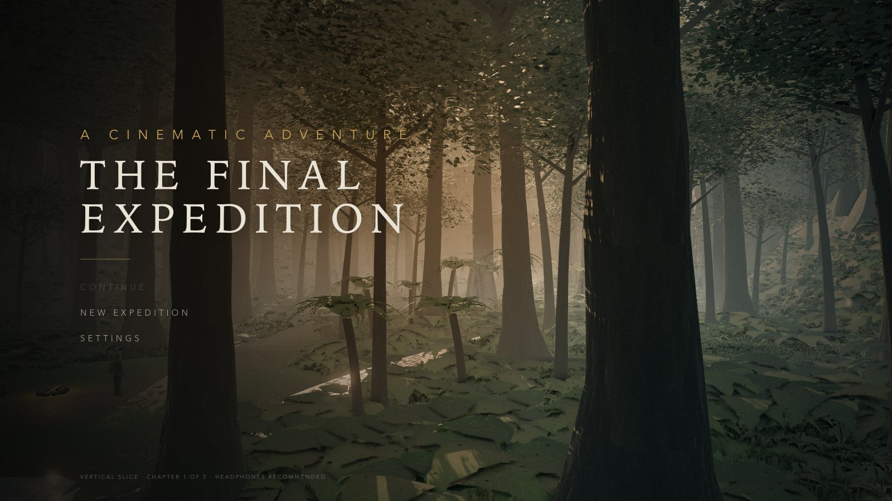

`Chapter 1 of 5 · Vertical slice` · `Three.js` · `TypeScript` · `WebGL 2` · `100% original, procedurally generated assets`

</div>

> 🚧 **Early build — v0.1 (Chapter 1 vertical slice).** This is just the first version of the game. More chapters, characters and features are loading… stay tuned. ⏳

---

In 1958 the Aldercott Expedition disappeared into the mist of the Cordillera Velada, and the official record says an avalanche killed everyone. Sixty-eight years later, **Ines Kovač**, a former mountain-rescue climber, finds an unsent letter in her grandmother's handwriting. It is dated *three years after* her grandmother was declared dead.

With her old friend **Toby** guarding the boat and talking on the radio, Ines goes upriver to find out what really happened.

## ▶️ Play the Game

> **No public deployment yet.** The game runs locally in any modern desktop browser with WebGL 2.

```bash
npm install
npm run dev        # open http://localhost:5173
```

Click **New Expedition**, then click inside the game to capture the mouse. Headphones are recommended, because all of the sound is spatial and procedurally synthesized.

<details>
<summary>Other commands</summary>

| Command | What it does |
|---|---|
| `npm run build` | Type-check + production build to `dist/` |
| `npm run preview` | Serve the production build |
| `npm run playtest` | Automated end-to-end playthrough in headless Chrome (needs `npm run dev` running) |
| `npm run gen:character` | Regenerate the temporary character models |
| `http://localhost:5173/?debug` | FPS / draw-call overlay + automation hooks |

</details>

---

## 🎬 About the Game

*The Final Expedition* is a story-driven exploration and traversal adventure: climbing, ancient puzzles, and cinematic moments. **Chapter 1, "The Discovery", is fully playable from start to finish.**

**The objective:** follow the trail of the 1958 expedition through the valley and reach whatever they were looking at on the ridge.

**The gameplay loop:**
1. **Explore** a hand-built dusk jungle valley, guided by landmarks, faded red cloth ribbons and a minimap objective marker.
2. **Investigate** the abandoned 1958 Camp Four, reading Marta's journal pages and examining what the expedition left behind.
3. **Climb** the red-rock cliff: wall climbs, ledge hangs and shimmies, a narrow ledge along the rock face, a jump across a broken stair, and a vault.
4. **Solve** the Gate of the Watching Sun by *observation* rather than guessing.
5. **Witness** the payoff in skippable cinematic sequences that blend back into gameplay.

The whole story, including characters, history, the artifact, the ending and unresolved mysteries, is kept in [`STORY_BIBLE.md`](STORY_BIBLE.md).

---

## ✨ Features

**Gameplay**
- 🧗 **Traversal system:**
  - wall climbing, and ledge hang / shimmy / climb-up;
  - a narrow ledge you edge along facing the rock;
  - an assisted gap jump, and a contextual vault;
  - hard landings;
  - lethal falls, which fade out and respawn you at the last checkpoint.
- 🧩 **Observation puzzle:** three rotating glyph drums. The clues are a rain-damaged sketch, carved murals, and the real position of the setting sun. Timed hints escalate if you get stuck.
- 📜 **Collectibles & journal:** three of Marta's journal pages and one Ysharu relic, readable in an in-game journal. Page 2 includes her sketch of the gate.
- 🎥 **Four cinematic sequences:**
  - the opening flyover;
  - a sighting through the 1958 surveyor's instrument (a theodolite);
  - the gate opening;
  - the city reveal.

  All four are letterboxed with depth of field, can be skipped by holding SPACE, and blend back into gameplay.
- 💬 **Subtitled dialogue & radio chatter** between Ines and Toby, triggered by where you go and what you examine.

**Systems**
- 🏃 **Third-person controller:**
  - acceleration and turning, sprint;
  - jump with coyote time and input buffering;
  - fall and landing states;
  - a custom kinematic capsule with step-up, ground snapping and slope limits.
- 🧱 **Collision:**
  - authored collision proxies: boxes for walls, ruins and props, cylinders for trunks and boulders;
  - smooth sliding along obstacles;
  - decorative foliage deliberately has no colliders.
- 📷 **Third-person camera:**
  - shoulder offset;
  - lag on following you;
  - a multi-ray spring arm that pulls in smoothly when an obstacle is in the way;
  - different framing for exploring, climbing and ledges;
  - wider field of view while sprinting;
  - camera shake.
- 🌿 **Interactive foliage:** grass, ferns and broadleaf plants bend away from the player and spring back. This is done in the shader, with no physics.
- 🗺️ **Minimap:**
  - rotates with the camera;
  - pulsing objective marker, with an arrow on the rim when it's off the map;
  - dots for places you've discovered;
  - can be turned off in settings.
- 💾 **Save system:**
  - autosaves at every checkpoint and whenever you leave or hide the tab;
  - manual save from the pause menu;
  - saves are versioned, with migrations;
  - **Continue** restores your exact position, puzzle state, collectibles and story progress.
- ⏸️ **Pause / resume:** freezes all game time exactly where it was, including cinematics, timers and particles, with a blurred backdrop and ducked audio.

**Audio & visuals**
- 🔊 **Fully synthesized audio:**
  - layered ambience: wind, insects, birds, frogs, drips;
  - spatial river and waterfall sound;
  - footsteps that change with the surface;
  - stone-mechanism sounds;
  - an adaptive score that shifts between explore, tension, wonder and title moods.
- 🌅 **Cinematic rendering:**
  - HDR pipeline with ambient occlusion, bloom and ACES tone mapping;
  - colour grading, film grain and vignette;
  - height fog that glows toward the sun;
  - fake volumetric light shafts, a procedural sky, and dynamic sun shadows.
- 💧 **Water:** a scrolling-normal river and pool, and a layered waterfall with falling droplets, splash, mist and ripples on the pool.
- ⚙️ **Graphics presets LOW / MEDIUM / HIGH:**
  - HIGH is adaptive: it steps its quality down, and back up, with the real frame rate;
  - on first launch, a default preset is picked from a check of your GPU.
- 🚀 **Performance:**
  - instanced, chunked vegetation that switches to simpler models with distance;
  - tiled terrain with distance-based detail;
  - merged static props;
  - GPU-animated particles;
  - chapters loaded only when needed.
  - Measured at ~60 fps on an Apple M5 with 270–340 draw calls, depending on the preset.
- ⚙️ **Settings:**
  - graphics: quality, field of view, camera shake, minimap, subtitles;
  - audio: master, music, effects and ambience volume;
  - controls: mouse sensitivity, invert Y, key rebinding.

---

## 🕹️ Controls

| Action | Keyboard / Mouse |
|---|---|
| Move | `W` `A` `S` `D` (or arrow keys) |
| Camera | Mouse *(click the game to capture it)* |
| Sprint | `Shift` |
| Jump · climb up from a hang | `Space` |
| Interact · start a climb · turn a drum · pick up | `E` or Left click |
| Climb / shimmy on walls and ledges | `W` `A` `S` `D` |
| Let go / drop | `C` or `Ctrl` |
| Journal | `J` or `Tab` |
| Pause | `Esc` or `P` |
| Skip cinematic | Hold `Space` |

All keys except `Esc` can be rebound in **Settings → Controls**. *Gamepad support is not implemented yet.*

---

## 🌎 World & Environment

Chapter 1 takes place in the lower Sael valley at dusk, just after rain. It is a fictional cloud-forest range, the Cordillera Velada, where the Ysharu, a vanished civilisation of astronomers and water engineers, carved their last city into a gorge.

<table>
<tr>
<td width="50%">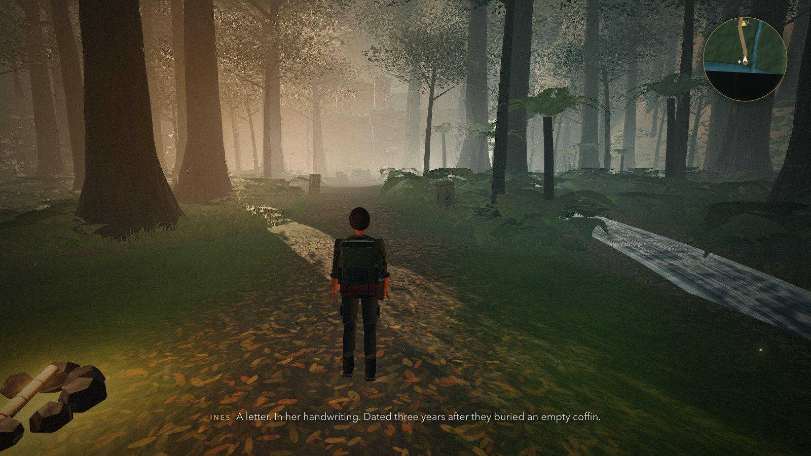</td>
<td width="50%">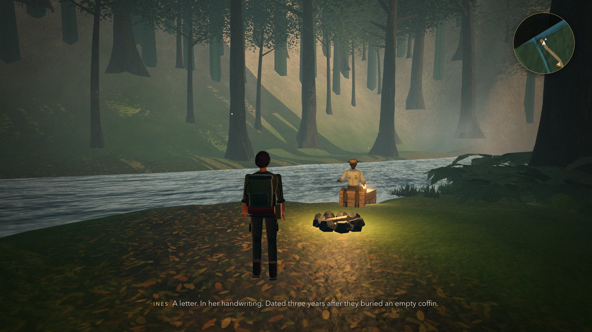</td>
</tr>
<tr>
<td><em>The river landing, where the expedition begins.</em></td>
<td><em>Toby, "heroically guarding the boat".</em></td>
</tr>
</table>

**The route**, from south to north:

- **The river landing:** Toby's boat, his campfire, and the start of the trail.
- **The jungle trail:** buttress-root trees, ferns, fireflies, drifting mist, and carved Ysharu stones marking the way.
- **Camp Four:** the expedition's abandoned 1958 camp. Collapsed tents, dinner still set on the stove, crates stencilled *ALDERCOTT 1958* and chalked *DO NOT SHIP*, and a surveyor's theodolite still aimed at the ridge.
- **The red-rock cliff and waterfall:** a climbing route marked with pitons and red ribbons that turn out to be *newer* than 1958.
- **The Gate of the Watching Sun:** a sealed ridge-top gate with glyph drums, murals of the sun's path, and the initials *M.K.* scratched into its base.
- **The Hollow Meridian:** a city of terraces, stairways, an aqueduct and a sun tower, glimpsed through the mist of the gorge.

> 🌅 *The sun really does set on your left when you face the gate. That is one of the puzzle's clues.*

---

## 🎥 Screenshots

### Exploration
<table>
<tr>
<td width="50%">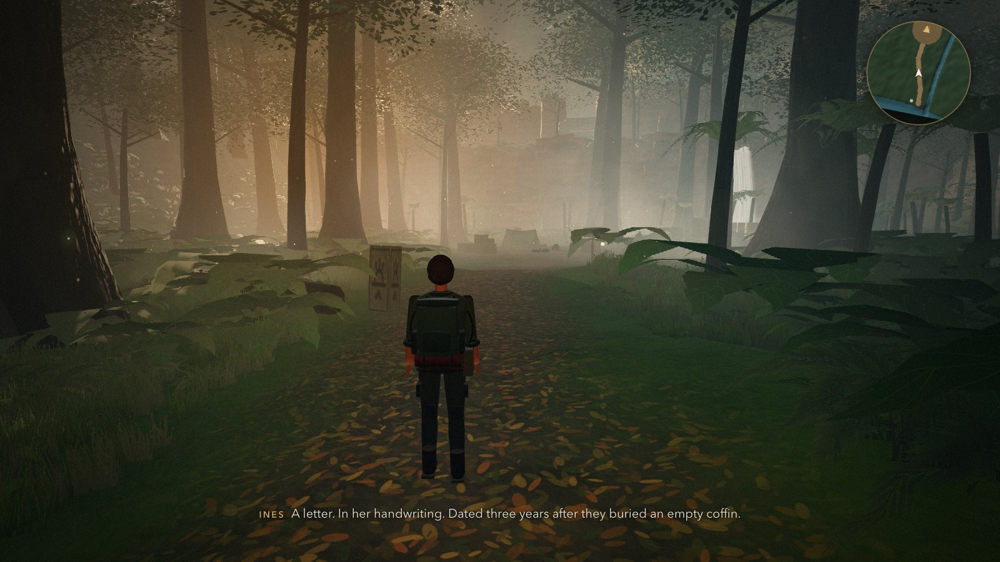</td>
<td width="50%">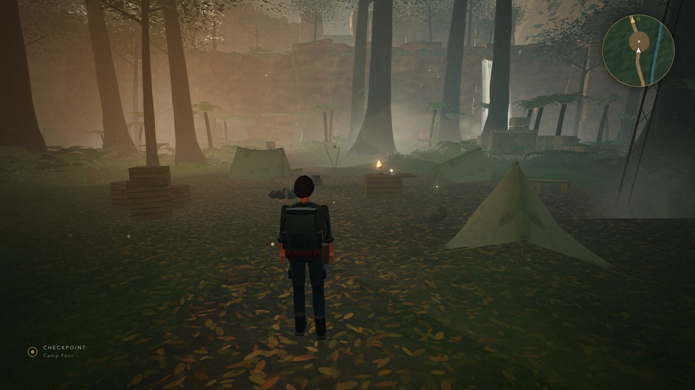</td>
</tr>
<tr>
<td><em>Following the trail cut long after 1958.</em></td>
<td><em>Camp Four, abandoned in a hurry.</em></td>
</tr>
</table>

### Traversal
<table>
<tr>
<td width="50%">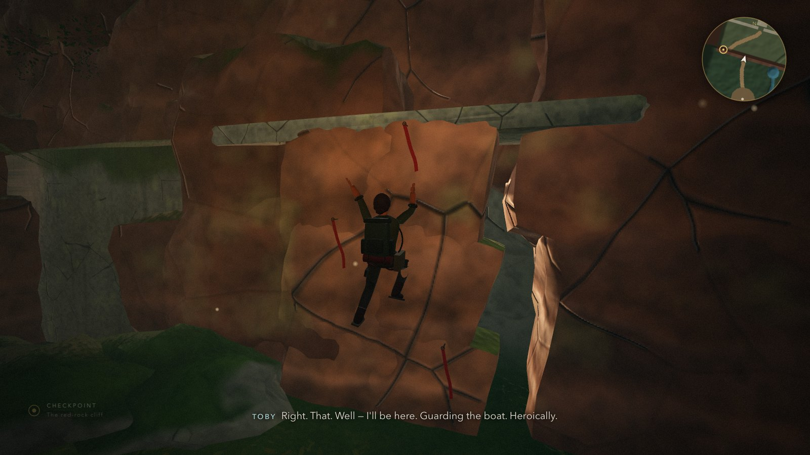</td>
<td width="50%">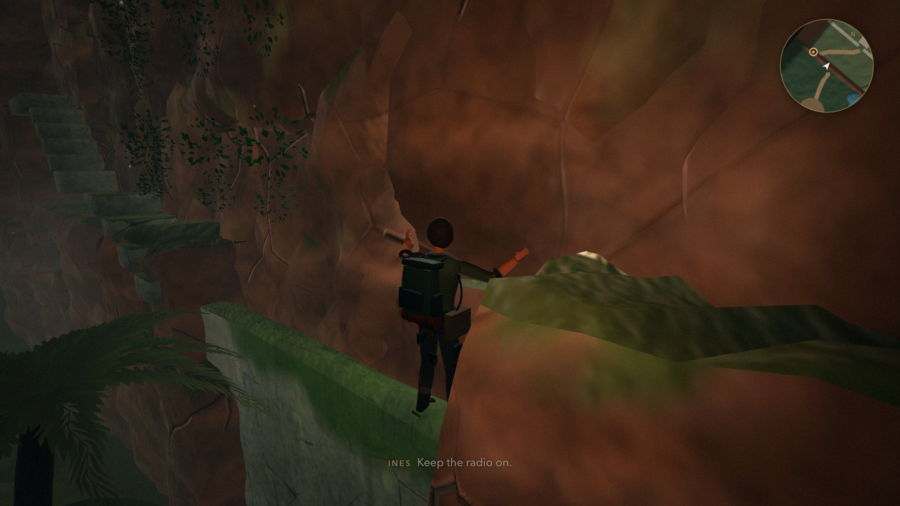</td>
</tr>
<tr>
<td><em>Climbing the red-rock cliff along the ribbon route.</em></td>
<td><em>Hugging the wall on the narrow ledge.</em></td>
</tr>
</table>

### Environment
<table>
<tr>
<td width="50%">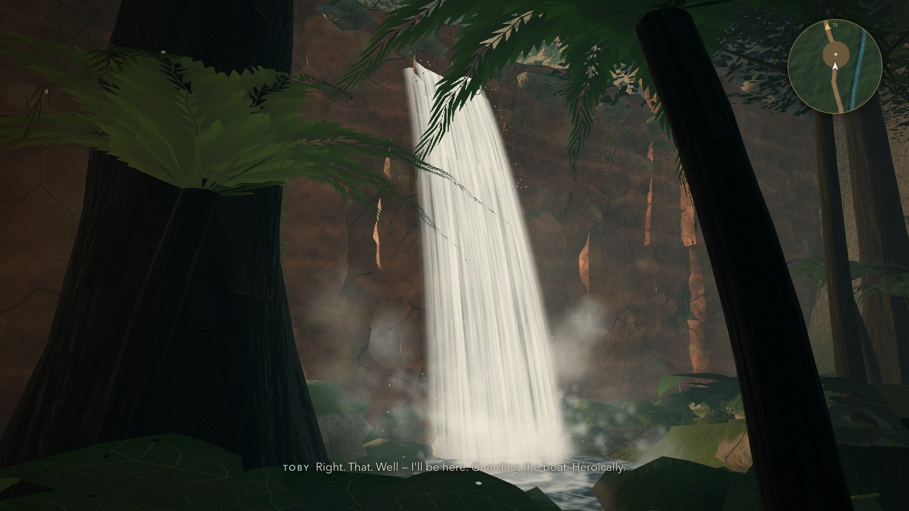</td>
<td width="50%">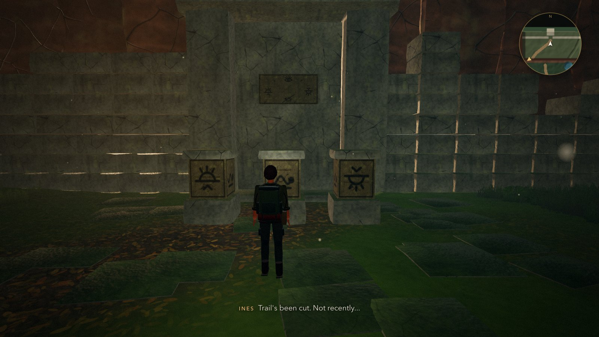</td>
</tr>
<tr>
<td><em>The falls at the foot of the cliff.</em></td>
<td><em>The Gate of the Watching Sun and its three drums.</em></td>
</tr>
</table>

### Special Moments
<table>
<tr>
<td width="50%">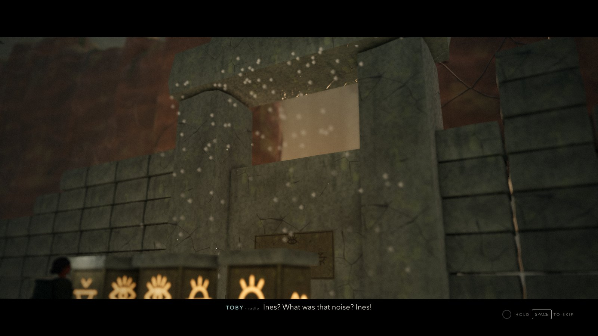</td>
<td width="50%">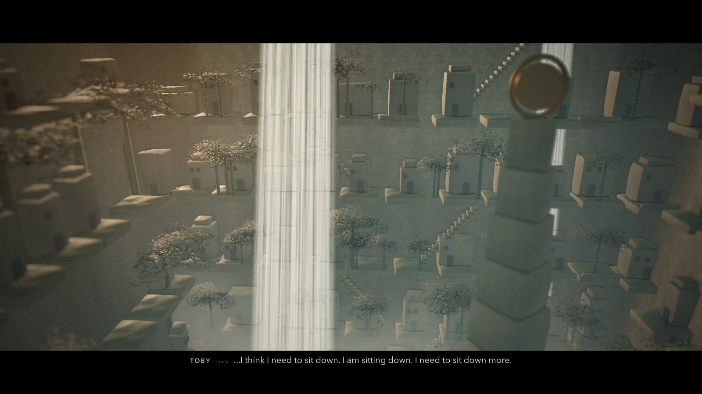</td>
</tr>
<tr>
<td><em>The drums lock and the gate begins to sink.</em></td>
<td><em>"Toby… there's a whole city down there."</em></td>
</tr>
</table>

### UI
<table>
<tr>
<td width="50%">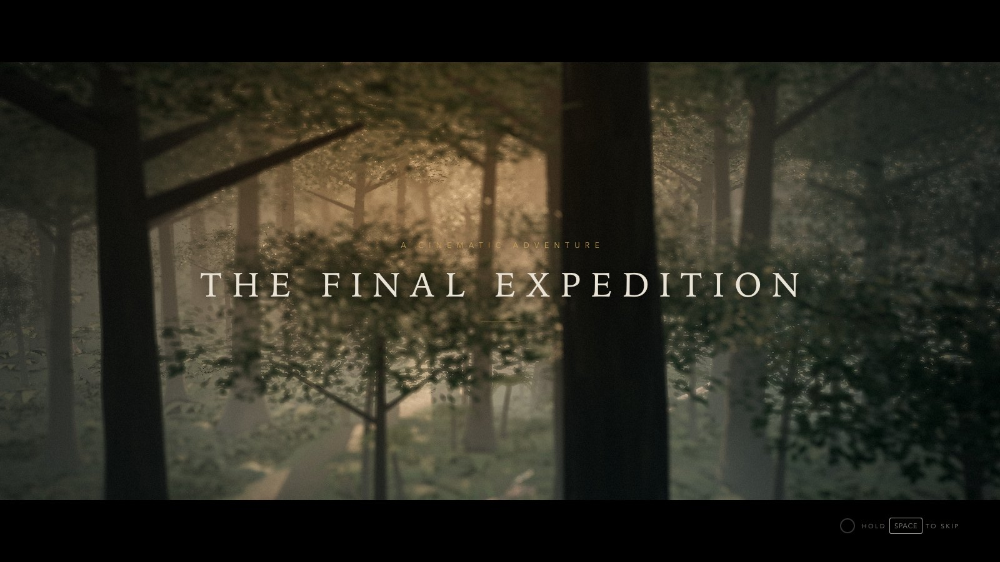</td>
<td width="50%">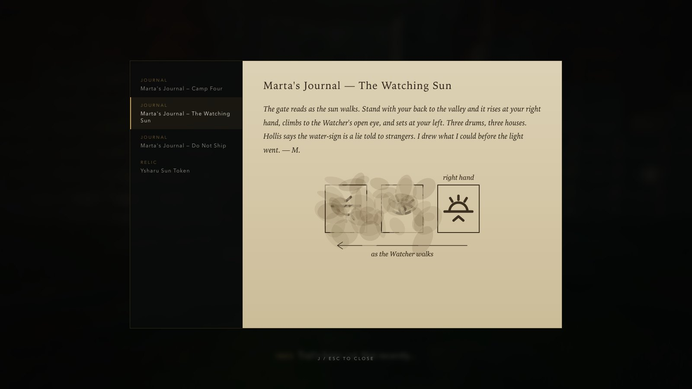</td>
</tr>
<tr>
<td><em>The opening flyover and title card.</em></td>
<td><em>Marta's journal, with the rain-damaged sketch of the gate.</em></td>
</tr>
</table>

<sub>Screenshots are real in-engine captures (HIGH preset, 1600×900), regenerated with <code>node scripts/readme-shots.mjs</code> while the dev server is running.</sub>

---

## 🧩 Technical Details

| Technology | Used for |
|---|---|
| **[Three.js](https://threejs.org/)** `0.186` | The rendering engine: scene graph and PBR materials, instancing, shadows, and the post-processing chain (EffectComposer, GTAO, bloom, SMAA/FXAA, output pass). It also loads GLTF/GLB models (with DRACO, Meshopt and KTX2 support) and plays skeletal animation. |
| **TypeScript** `7` | The entire game codebase, in strict mode. |
| **Vite** `8` | Development server, hot reload, production bundling, and code splitting that loads chapters on demand. |
| **WebGL 2 / GLSL** | Custom shaders: triplanar rock with moss and wetness, terrain texture blending, wind and player-push foliage, water, waterfall, sky, height fog, particles, light shafts, depth of field and colour grading. |
| **Web Audio API** | Every sound is synthesized live: noise-based ambience, spatial emitters, one-shot sound effects, a generated reverb and the adaptive music. |
| **HTML / CSS** | Menus, HUD, subtitles, journal, settings and minimap (a 2D canvas). |
| **localStorage** | Versioned save slots and settings. There is no backend. |
| **Node.js** | `scripts/gen-temp-character.mjs` builds the rigged, animated character GLBs using Three.js' `GLTFExporter`. |
| **Playwright** *(dev only)* | An automated end-to-end playtest (51 checks) plus screenshot and performance scripts, all run in installed Chrome. |

**Everything visible and audible is generated by project code:** textures, terrain, vegetation, ruins, props, characters, sound and music. No third-party art or audio is used; see [`ASSET_LICENSES.md`](ASSET_LICENSES.md).

---

## 📁 Project Structure

```text
the-final-expedition/
├── index.html
├── package.json
├── vite.config.ts
├── tsconfig.json
├── STORY_BIBLE.md            # locked story: characters, history, chapters, ending
├── ASSET_LICENSES.md
├── docs/screenshots/         # README images (real in-engine captures)
├── public/
│   ├── assets/models/temp/   # generated character GLBs (Ines, Toby) — replaceable
│   └── decoders/             # DRACO / Basis decoders (copied on dev/build)
├── scripts/
│   ├── gen-temp-character.mjs  # builds the rigged + animated character GLBs
│   ├── playtest.mjs            # end-to-end automated playthrough
│   ├── readme-shots.mjs        # captures the README screenshots
│   └── …                       # probes, perf & collision test scripts
└── src/
    ├── main/          # boot, Game loop & state machine, pausable GameClock
    ├── chapters/      # Chapter interface, ChapterManager, registry
    │   └── ch1/       # "The Discovery": layout, world build, gorge city, logic & cinematics
    ├── player/        # player controller + traversal state machine
    ├── physics/       # heightfield, collision world, kinematic character motor
    ├── traversal/     # authored climb surfaces, ledges, narrow ledges, vaults, jumps
    ├── camera/        # third-person camera rig
    ├── cinematic/     # sequences + cinematic director
    ├── animation/     # asset-agnostic animation driver, additive layers, avatar
    ├── puzzles/       # puzzle base + rotating drums
    ├── interaction/   # contextual "E" interactions
    ├── story/         # dialogue system, collectibles, chapter dialogue
    ├── render/        # renderer, post-FX, sky, height fog, materials, procedural textures
    ├── world/         # terrain, rocks, vegetation, water, waterfall FX, particles, props
    ├── audio/         # audio engine, SFX, ambience, adaptive music
    ├── input/         # action-based input manager + device providers
    ├── save/          # save schema, migrations, save manager, settings
    ├── state/         # Persistable systems registry + snapshots
    ├── assets/        # asset manager + character manifest
    ├── systems/       # events, quality presets, perf monitor, noise, pooling
    ├── ui/            # loading, menus, settings, HUD, minimap, journal
    └── debug/         # ?debug automation hooks
```

---

## 🧭 Roadmap & Known Limitations

- **Chapters 2–5** (*Into the Unknown*, *The Hidden Path*, *The Expedition*, *The Final Expedition*): the story is written in the bible, but the levels aren't built yet. Continuing past Chapter 1 shows an "in development" card.
- **Gamepad support** has an extension point in the input system, but does nothing yet.
- **Characters** are temporary, generated models: no facial animation, and feet don't adjust to slopes. You can swap them by changing `src/assets/characters.json`.
- **No voice acting:** dialogue is subtitles only, with a radio sound.
- **Browsers:** tested in Chrome. Firefox and Safari have not been verified.

<div align="center">

---

*Original story, characters, world and assets. Not affiliated with any existing game franchise.*

</div>
